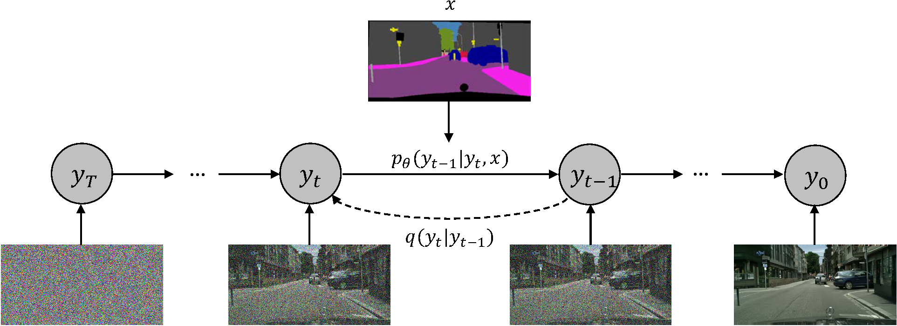
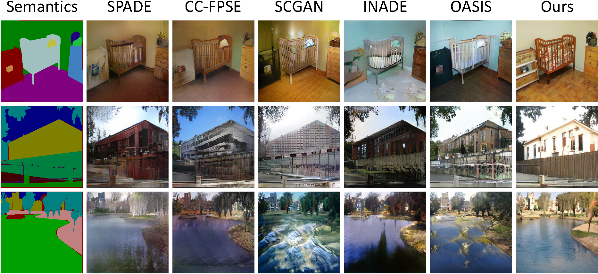
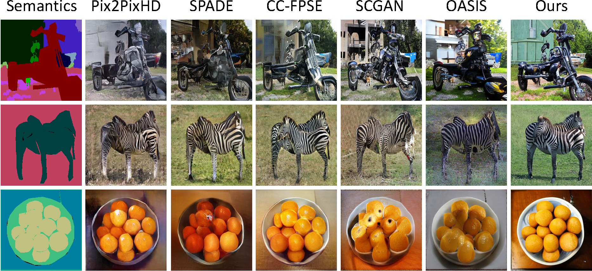

# Semantic Image Synthesis via Diffusion Models (SDM)

&nbsp;

  

&nbsp;



&nbsp;

### [Paper](https://arxiv.org/abs/2207.00050)

[Weilun Wang](https://scholar.google.com/citations?hl=zh-CN&user=YfV4aCQAAAAJ), [Jianmin Bao](https://scholar.google.com/citations?hl=zh-CN&user=hjwvkYUAAAAJ), [Wengang Zhou](https://scholar.google.com/citations?hl=zh-CN&user=8s1JF8YAAAAJ), [Dongdong Chen](https://scholar.google.com/citations?hl=zh-CN&user=sYKpKqEAAAAJ), [Dong Chen](https://scholar.google.com/citations?hl=zh-CN&user=_fKSYOwAAAAJ), [Lu Yuan](https://scholar.google.com/citations?hl=zh-CN&user=k9TsUVsAAAAJ), [Houqiang Li](https://scholar.google.com/citations?hl=zh-CN&user=7sFMIKoAAAAJ),

## Abstract

We provide our PyTorch implementation of Semantic Image Synthesis via Diffusion Models (SDM). 
In this paper, we propose a novel framework based on DDPM for semantic image synthesis.
Unlike previous conditional diffusion model directly feeds the semantic layout and noisy image as input to a U-Net structure, which may not fully leverage the information in the input semantic mask,
our framework processes semantic layout and noisy image differently.
It feeds noisy image to the encoder of the U-Net structure while the semantic layout to the decoder by multi-layer spatially-adaptive normalization operators. 
To further improve the generation quality and semantic interpretability in semantic image synthesis, we introduce the classifier-free guidance sampling strategy, which acknowledge the scores of an unconditional model for sampling process.
Extensive experiments on three benchmark datasets demonstrate the effectiveness of our proposed method, achieving state-of-the-art performance in terms of fidelity (FID) and diversity (LPIPS).


## Example Results
* **Cityscapes:**

<p align='center'>  
  
</p>

* **CelebA:**

<p align='center'>  
  
</p>

* **ADE20K:**

<p align='center'>  
  
</p>

* **COCO-Stuff:**

<p align='center'>  
  
</p>

## Prerequisites
- Linux
- Python 3
- CPU or NVIDIA GPU + CUDA CuDNN

## Dataset Preparation
The Cityscapes and ADE20K dataset can be downloaded and prepared following [SPADE](https://github.com/NVlabs/SPADE.git). The CelebAMask-HQ can be downloaded from [CelebAMask-HQ](https://github.com/switchablenorms/CelebAMask-HQ), you need to to integrate the separated annotations into an image file (the format like other datasets, e.g. Cityscapes and ADE20K). 

### NEGCUT Training and Test

- Download the dataset.

- Train the SDM model:
```bash
export OPENAI_LOGDIR='OUTPUT/ADE20K-SDM-256CH'
mpiexec -n 8 python image_train.py --data_dir ./data/ade20k --dataset_mode ade20k --lr 1e-4 --batch_size 4 --attention_resolutions 32,16,8 --diffusion_steps 1000 \
                                   --image_size 256 --learn_sigma True --noise_schedule linear --num_channels 256 --num_head_channels 64 --num_res_blocks 2  \
                                   --resblock_updown True --use_fp16 True --use_scale_shift_norm True --use_checkpoint True --num_classes 151 \
	                           --class_cond True --no_instance True
```

- Fine-tune the SDM model:
```bash
export OPENAI_LOGDIR='OUTPUT/ADE20K-SDM-256CH-FINETUNE'
mpiexec -n 8 python image_train.py --data_dir ./data/ade20k --dataset_mode ade20k --lr 2e-5 --batch_size 4 --attention_resolutions 32,16,8 --diffusion_steps 1000 \
                                   --image_size 256 --learn_sigma True --noise_schedule linear --num_channels 256 --num_head_channels 64 --num_res_blocks 2 \
                                   --resblock_updown True --use_fp16 True --use_scale_shift_norm True --use_checkpoint True --num_classes 151 --class_cond True \
                                   --no_instance True --drop_rate 0.2 --resume_checkpoint OUTPUT/ADE20K-SDM-256CH/model.pt
```

- Test the SDM model:
```bash
mpiexec -n 8 python image_sample.py --data_dir ./data/ade20k --dataset_mode ade20k --attention_resolutions 32,16,8 --diffusion_steps 1000 \
                                    --image_size 256 --learn_sigma True --noise_schedule linear --num_channels 256 --num_head_channels 64 \ 
                                    --num_res_blocks 2 --resblock_updown True --use_fp16 True --use_scale_shift_norm True --num_classes 151 \
                                    --class_cond True --no_instance True --batch_size 2 --num_samples 2000 --s 1.5 \
                                    --model_path OUTPUT/ADE20K-SDM-256CH-FINETUNE/ema_0.9999_best.pt --results_path RESULTS/ADE20K-SDM-256CH
```

Please refer to the 'scripts/ade20.sh' for more details.

### Apply a pre-trained NEGCUT model and evaluate

#### Pretrained Models (to be updated)
|Dataset       |Download link     |
|:-------------|:-----------------|
|Cityscapes|[Visual results](https://drive.google.com/file/d/1TbLGCFJqRI4E8pFZJoHmj8MgDbwtjzhP/view?usp=sharing)|
|ADE20K|[Checkpoint](https://drive.google.com/file/d/1O8Avsvfc8rP9LIt5tkJxowMTpi1nYiik/view?usp=sharing) \| [Visual results](https://drive.google.com/file/d/1NIXmrlBHqgyMHAoLBlmU8YELmL8Ij4kV/view?usp=sharing)|
|CelebAMask-HQ |[Checkpoint](https://drive.google.com/file/d/1iwpruJ5HMHdAA1tuNR8dHkcjGtxzSFV_/view?usp=sharing) \| [Visual results](https://drive.google.com/file/d/1NDfU905iJINu4raoj4JdMOiHP8rTXr_M/view?usp=sharing)|
|COCO-Stuff |[Checkpoint](https://drive.google.com/file/d/17XhegAk8V5W3YiFpHMBUn0LED-n7B44Y/view?usp=sharing) \| [Visual results](https://drive.google.com/file/d/1ZluvN9spJF8jlXlSQ98ekWTmHrzwYCqo/view?usp=sharing)|

- To evaluate the model (e.g., ADE20K), first generate the test results:
```bash
mpiexec -n 8 python image_sample.py --data_dir ./data/ade20k --dataset_mode ade20k --attention_resolutions 32,16,8 --diffusion_steps 1000 \
                                    --image_size 256 --learn_sigma True --noise_schedule linear --num_channels 256 --num_head_channels 64 \ 
                                    --num_res_blocks 2 --resblock_updown True --use_fp16 True --use_scale_shift_norm True --num_classes 151 \
                                    --class_cond True --no_instance True --batch_size 2 --num_samples 2000 --s 1.5 \
                                    --model_path OUTPUT/ADE20K-SDM-256CH-FINETUNE/ema_0.9999_best.pt --results_path RESULTS/ADE20K-SDM-256CH
```

- To calucate FID metric, you should update "path1" and "path2" in "evaluations/test_with_FID.py" and run:
```bash
python evaluations/test_with_FID.py
```

- To calcuate LPIPS, you should evaluate the model for 10 times and run:
```bash
python evaluations/lpips.py GENERATED_IMAGES_DIR
```

### Acknowledge
Our code is developed based on [guided-diffusion](https://github.com/openai/guided-diffusion). We also thank "test_with_FID.py" in [OASIS](https://github.com/boschresearch/OASIS) for FID computation, "lpips.py" in [stargan-v2](https://github.com/clovaai/stargan-v2) for LPIPS computation.
